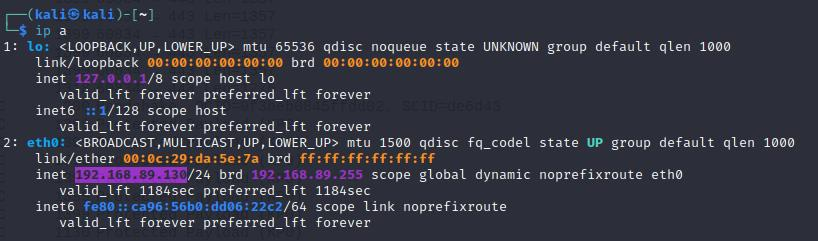
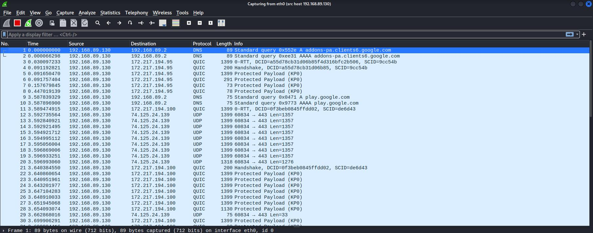

# Jarkom-Modul-1-ITA01-2022

Hasil Pengerjaan Soal Shift Praktikum SISTEM OPERASI 2022
Anggota Kelompok:
1. Muhammad Faris Anwari (5027201008)
2. Calvindra Laksmono Kumoro (5027201020)
3. Adinda Putri Audyna (5027201073)

Pembagian Kontribusi:
- Soal 1-3: Calvindra Laksmono Kumoro
- Soal 4-6: Adinda Putri Audyna
- Soal 7-10: Muhammad Faris Anwari

## Soal 1-3
### 1. Sebutkan web server yang digunakan pada "monta.if.its.ac.id"!
Praktikan mencari web server dengan kata kunci `monta` melalui filter berikut:


Kemudian praktikan mengfollow HTTP Stream hingga didapati web server yang dimaksud.


---

### 2. Ishaq sedang bingung mencari topik ta untuk semester ini , lalu ia datang ke website monta dan menemukan detail topik pada website “monta.if.its.ac.id” , judul TA apa yang dibuka oleh ishaq ?
Praktikan memfilter dengan cara yang sama di nomor 1.


Lalu praktikan mengklik kanan salah satu entri secara acak, lalu Follow -> HTTP Stream. Hasilnya sebagaimana tergambarkan di bawah.


Praktikan mengganti tampilan data menjadi Raw.


Raw file kemudian di-*save as* sebagai .html


Praktikan membuka HTML dan mengklik `4222` di kolom ID dalam bagian Sidang Proposal Tugas Akhir.


Sehingga didapatlah judul TA, yakni 

> **Perancangan Sistem Pengendali Panas Otomatis pada Mesin Sangrai Kopi dengan Logika Fuzzy**

---

### 3. Filter sehingga wireshark hanya menampilkan paket yang menuju port 80!
Filter:

```
tcp.dstport == 80 || udp.dstport == 80
```

Hasil:


---

## Soal 4-6
### 4. Filter sehingga wireshark hanya mengambil paket yang berasal dari port 21!
Untuk soal ini, karena packet sudah ada di .pcapng, maka buka Wireshark dan open filenya, lalu terapkan Read Filter (sintaks sama dengan display filter, meskipun pada efeknya mirip capture filter bagi file .pcapng)

```
tcp.srcport == 21 || udp.srcport == 21
```


---

### 5. Filter sehingga wireshark hanya mengambil paket yang berasal dari port 443!
Untuk soal ini, karena packet sudah ada di .pcapng, maka buka Wireshark dan open filenya, lalu terapkan Read Filter (sintaks sama dengan display filter, meskipun pada efeknya mirip capture filter bagi file .pcapng)

```
tcp.srcport == 443 || udp.srcport == 443
```


---

### 6. Filter sehingga wireshark hanya menampilkan paket yang menuju ke lipi.go.id!
Pertama kita melakukan pengecekan ip pada website lipi.go.id ke dalam terminal dengan menggunakan command `ping lipi.go.id`


Lalu didapat ip 203.160.128.158 sehingga

```
ip.dst== 203.160.128.158 || ip.dst== 203.160.128.158
```


---

## Soal 7-10
### 7. Filter sehingga wireshark hanya mengambil paket yang berasal dari ip kalian!

Sebelumnya praktikan menginput command [ip a] di terminal untuk mengetahui IP praktikan.



Sehingga didapat IP praktikan ialah `192.168.89.130`.

Capture Filter: 
```
src host 192.168.89.130
```



Dengan demikian, praktikan berhasil mengambil paket yang berasal dari IP praktikan.

---

Untuk soal 8-10, silahkan baca cerita di bawah ini!

> Di sebuah planet bernama Viltrumite, terdapat Kementerian Komunikasi dan Informatika yang baru saja menetapkan kebijakan baru. Dalam kebijakan baru tersebut, pemerintah dapat mengakses data pribadi masyarakat secara bebas jika memang dibutuhkan, baik dengan maupun tanpa persetujuan pihak yang bersangkutan. Sebagai mahasiswa yang sedang melaksanakan program magang di kementerian tersebut, kalian mendapat tugas berupa penyadapan percakapan mahasiswa yang diduga melakukan tindak kecurangan dalam kegiatan Praktikum Komunikasi Data dan Jaringan Komputer 2022. Selain itu, terdapat sebuah password rahasia (flag) yang diduga merupakan milik sebuah organisasi bawah tanah yang selama ini tidak sejalan dengan pemerintahan Planet Viltrumite. Tunggu apa lagi, segera kerjakan tugas magang tersebut agar kalian bisa mendapatkan pujian serta kenaikan jabatan di kementerian tersebut!

### 8. Telusuri aliran paket dalam file .pcap yang diberikan, cari informasi berguna berupa percakapan antara dua mahasiswa terkait tindakan kecurangan pada kegiatan praktikum. Percakapan tersebut dilaporkan menggunakan protokol jaringan dengan tingkat keandalan yang tinggi dalam pertukaran datanya sehingga kalian perlu menerapkan filter dengan protokol yang tersebut.

Praktikan mendapat isi percakapan dengan cara mengfollow TCP stream lalu meng*bruteforce* klik pindah stream hingga mendapati percakapan mencurigakan di stream 12. Ternyata setelah diobservasi lebih lanjut, percakapan antara dua mahasiswa ini melibatkan port 60236 dan 65432.


Dari percakapan ini, praktikan memeroleh informasi penting perihal kecurangan, bahwa:
- File selundupan merupakan file salt
- File dapat didecrypt dengan metode des3
- Password ialah nama karakter anime kembar lima
- Pengiriman file lewat port 9002

---

### 9. Terdapat laporan adanya pertukaran file yang dilakukan oleh kedua mahasiswa dalam percakapan yang diperoleh, carilah file yang dimaksud! Untuk memudahkan laporan kepada atasan, beri nama file yang ditemukan dengan format [nama_kelompok].des3 dan simpan output file dengan nama “flag.txt”.

Praktikan menyimpulkan bahwa nama karakter anime kembar lima ialah `nakano` dari Gotoubun no Hanayome. Kemudian praktikan mencoba mencari paket yang berasal dari port 9002 dengan display filter berikut:

```
tcp.srcport == 9002
```


Praktikan lalu mengfollow TCP stream paket-paket tersebut.


Rupanya ini merupakan jejak palsu. Praktikan tertipu oleh link-link palsu tersebut, dan diarahkan menuju video meme. Disinilah letak kendala yang praktikan alami. Setelah pertimbangan lebih lanjut, praktikan menggunakan filter:

```
tcp.dstport == 9002
```


Praktikan mengfollow TCP Stream dan mendapatkan *jackpot*


Praktikan mengubah tipe data menjadi raw dan menyimpannya sebagai `ITA02.des3`, lalu mendecryptnya menggunakan openssl dengan password `nakano`


---

### 10. Temukan password rahasia (flag) dari organisasi bawah tanah yang disebutkan di atas!

Praktikan membuka file flag.txt dan mendapat password rahasia sebagaimana berikut:


---

### Kendala yang Dialami

- Praktikan sempat terhambat dalam mencari file salt yang dikirim di port 9002, hingga praktikan menyadari bahwa bisa saja file dikirim *kepada* port 9002, bukan hanya *dari* port 9002
- Praktikan juga terkendala dalam mengdecrypt file salt, dimana praktikan mengsolve kendala ini dengan mencari syntax openssl yang sesuai di [https://osxdaily.com/2012/01/30/encrypt-and-decrypt-files-with-openssl/](https://osxdaily.com/2012/01/30/encrypt-and-decrypt-files-with-openssl/)
